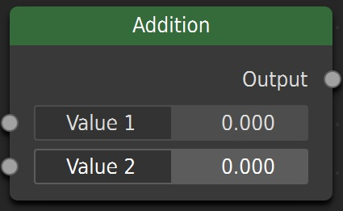
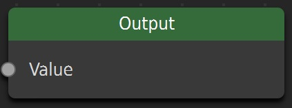
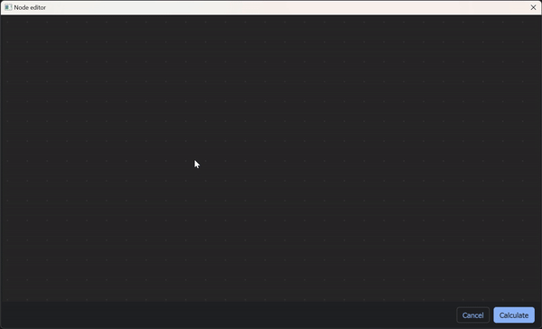
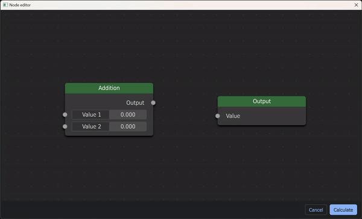
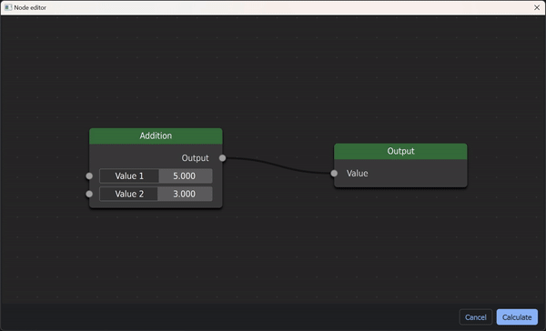
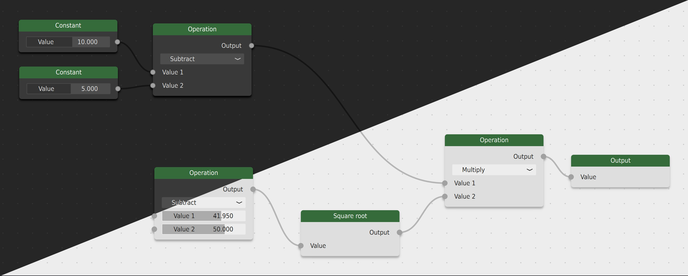

Getting started
===============
This page shows a short example of how to open a node editor with custom nodes.

Creating nodes
--------------
To start using the node editor, we will need to define the nodes that are available in our scene.
For this example, we will create a node that adds two inputs together, and a node that acts as the output.

We can create a new node by deriving from the Node class. Every node type must have a unique code.

.. code-block:: python

    from QNodeEditor import Node

    class AddNode(Node):
        code = 0  # Unique code for this node
        ...

Here, we implement two functions that dictate the look and behaviour of our node. First is the create() function that
sets the properties and elements of the node when it is created:

.. code-block:: python

        ...
        def create(self):
            self.title = 'Addition'  # Set the title of the node

            self.add_label_output('Output')  # Add output for the result
            self.add_value_input('Value 1')  # Add input for the first value
            self.add_value_input('Value 2')  # Add input for the second value
        ...

The second function to implement is the evaluate() function which receives the values of all node elements, and can set outputs when the node scene is evaluated:

.. code-block:: python

        ...
        def evaluate(self, values):
            # Calculate the result by adding the entries 'Value 1' and 'Value 2'
            result = values['Value 1'] + values['Value 2']

            # Set the output with the name 'Output' with this calculated value
            self.set_output_value('Output', result)

This code will create our addition node that looks like this:

    Addition node

When evaluated, the node will take the values with names ``Value 1`` and ``Value 2`` and add them together.
This result is set as the output value with the name ``Output``.

Similarly, we will create an output node that only has inputs (the evaluate() function is not used).

.. code-block:: python

    class OutNode(Node):
        code = 1  # Unique code for this node

        def create():
            self.title = ''  # Set the title of the node
            self.add_label_input('Value')  # Add input value

This output node will look like this

    Output node

Creating an application
-----------------------
Now, we are ready to open a node editor with these nodes. We create a PyQt application and use the NodeEditorDialog widget from QNodeEditor:

.. code-block:: python

    from PyQt.QtWidgets import QApplication
    from QNodeEditor import NodeEditorDialog

    # Create an application and a node editor widget
    app = QApplication([])
    dialog = NodeEditorDialog()
    ...

We have to specify the nodes that are available for the editor, and which node we want to use as the output node.
For the available nodes, we create a dictionary with (name: class) pairs.

.. code-block:: python

    # Set the available nodes and the output node
    dialog.editor.available_nodes = {'Addition': AddNode, 'Output': OutNode}
    dialog.editor.output_node = OutNode
    ...

Now, we are ready to run the application:

.. code-block:: python

    # Run the dialog and if it succeeds, print the result
    if dialog.exec():
        print(dialog.result)

    # Run the PyQt application
    app.exec()

Running the application
-----------------------
Running the code now opens the dialog with an empty scene (the window style might differ, but the node editor style will be the same).

We can add new nodes through the right-click menu. In the ``Add`` sub-menu, you will find the available nodes
we defined before. Click on one to start placing it.

    Adding nodes to an empty scene

Once placed, we can connect nodes by clicking on one socket and dragging it to another:

    Connecting two sockets with an edge

We can alter the values in the addition node by clicking and dragging the box, or by clicking on the box and entering a new value:

    Changing the values in the addition node

Now we are ready to evaluate our scene. Click on ``Calculate``. If everything went right, the dialog will close, and you will see the
calculation result printed in your terminal:

.. code-block:: console

    $ python getting_started.py

    {'Value': <number>}

The result is a dictionary with as keys the names of the inputs of our ``OutNode``, and as value the calculated input that is wired to it.
If no value is wired to the output, the value will be ``None``.

Handling errors
---------------
Any errors that occur during the evaluation are automatically handled by the dialog.

For example, we can cause an error in the ``evaluate()`` function of the ``AddNode`` by trying to divide a value by zero:

.. code-block:: python
    :emphasize-lines: 4

    class AddNode(Node):
        ...
        def evaluate(self, values):
            result = 1 / 0
            self.set_output_value('Output', result)

If we run the code again and try evaluating the same setup as before, we will see that an error occurred.

We can click on details to see the exact file and error that took place. In this case, it is a ``ZeroDivisionError``, which is what we expect.

    Error occurring during evaluation, with automated handling

Changing themes
---------------
It is easy to change the theme of the node editor. The node editor comes
with two pre-defined themes: dark (default), and light. It is easy to create your own themes as well.

To change a theme, we can simply import one and set it as the dialog's theme:

.. code-block:: python
    :emphasize-lines: 4

    from QNodeEditor.themes import LightTheme

    ...
    dialog.theme = LightTheme
    ...

Running the code now shows a light-themed node editor.

    Comparison of dark and light theme

Check out the page `Defining themes <#>`_ for instructions on adding your own themes.
