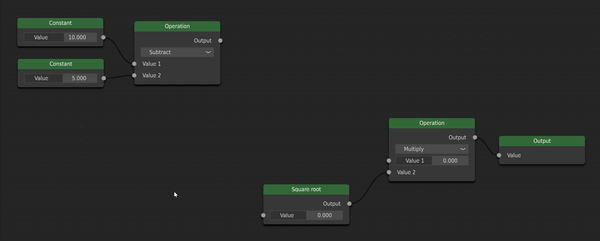

===========
QNodeEditor
===========
|badge_pylint| |badge_github| |badge_pypi|

.. |badge_pylint| image:: https://img.shields.io/badge/pylint-9.84-yellow?logo=python&logoColor=white
    :alt: pylint badge
.. |badge_github| image:: https://img.shields.io/badge/github--blue?logo=github
    :target: https://github.com/JasperJeuken/QNodeEditor
    :alt: Github badge
.. |badge_pypi| image:: https://img.shields.io/badge/PyPi--blue?logo=pypi
    :target: https://pypi.org/project/QNodeEditor/
    :alt: PyPi badge

This is the documentation for the QNodeEditor package.

.. note::
   This documentation was automatically built from the `Github repository <https://github.com/JasperJeuken/QNodeEditor>`_
   and was generated on |today|.

    Interacting with a sample node scene

Installation
============
To install QNodeEditor, use the following command to install the package from `PyPi <https://pypi.org/project/QNodeEditor/>`_:

.. code-block::

   pip install QNodeEditor

Alternatively, you can clone and install the source code from the `Github repository <https://github.com/JasperJeuken/QNodeEditor>`_:

.. code-block::

   git clone https://github.com/JasperJeuken/QNodeEditor.git

   pip install -e .

Overview
========
The QNodeEditor package aims to provide flexible tools for making any sort of node editor you can imagine. The package provides
a structure for interacting with and evaluating a node scene. This scene will contain nodes that you can easily define yourself.

All nodes consist of various entries, which can have an input or output socket (or neither). The package comes
with a few pre-defined entries, such as one with simple label, or a value selector (int or float). However, it is trivial
to create your own entries with any widget(s) you need.

The evaluation of node scenes happens asynchronously. For longer computations this avoids the interface from freezing.
Any errors that are throws during evaluation are caught and forwarded, such that they can be handled by you.

Contents
========

.. toctree::
    :maxdepth: 2

    self
    getting_started.rst

.. sidebar-links::
    :github:
    :pypi: QNodeEditor

Indices and tables
==================

* :ref:`genindex`
* :ref:`modindex`
